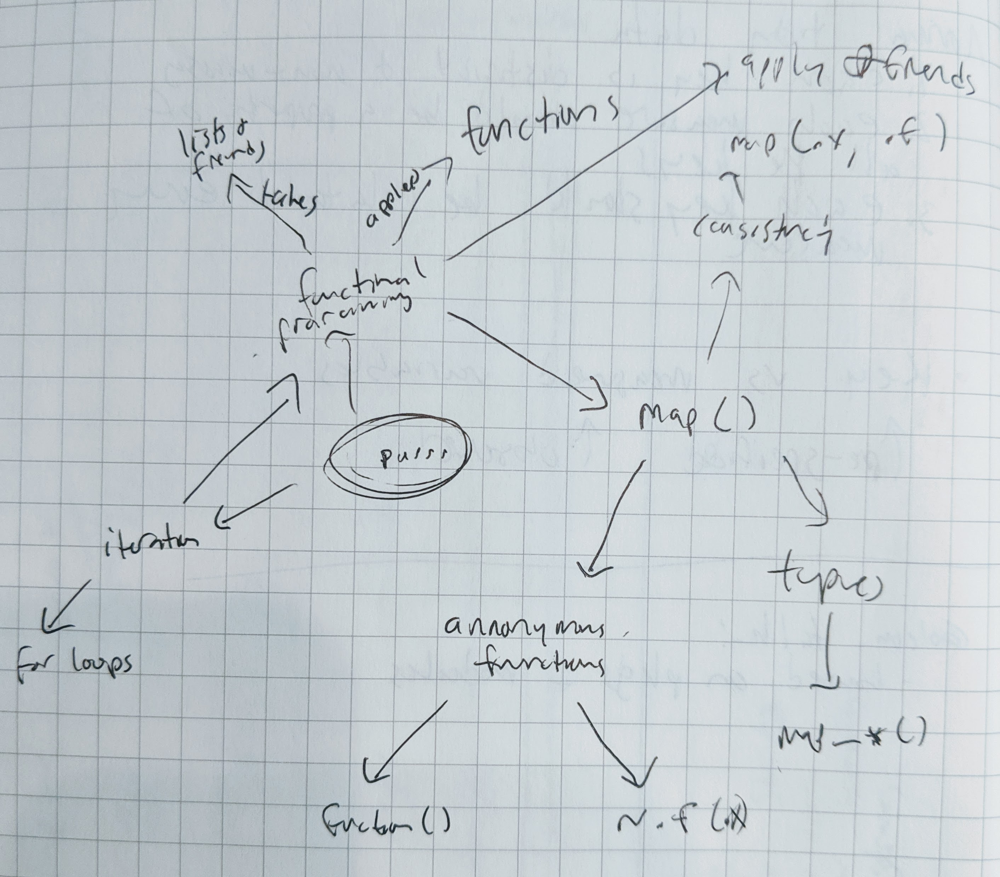

<!-- README.md is generated from README.Rmd. Please edit that file -->

```{r, include = FALSE}
knitr::opts_chunk$set(
  collapse = TRUE,
  comment = "#>"
)
```

# RStudio Certified Instructor exam: teaching purrr

<!-- badges: start -->
<!-- badges: end -->

This repository contains a short collection of teaching materials for purrr. [You can find a hosted version of the slides here](https://frosty-haibt-f2b464.netlify.com). The exercises are contained in `exercises.Rmd`.

# Concept map



# Learner personas

1. Phoebe is an early-career health researcher. She has a PhD in epidemiology, but most of her training and experience have been with SAS and Stata. She took an R course once, but it didn't really stick, and she didn't learn anything about the Tidyverse. She's seen the new tools available and is interested in learning them as she starts her own lab. She's too busy to take a formal course, so an intensive workshop works better for her.

2. Cal is a long-time R user and senior researcher. He mostly leads the lab these days and doesn't do as much analysis, but his students are starting to use the Tidyverse. He learned R in its early days and hasn't kept up with the ecosystem. He wants to be able to work with his students' code and make recommendations for future students. 
