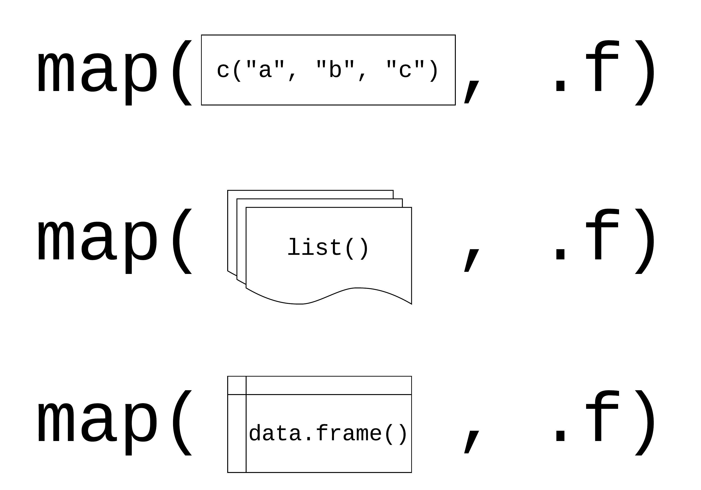

```{r setup, include=FALSE}
options(htmltools.dir.version = FALSE)
knitr::opts_chunk$set(warning = FALSE, message = FALSE, fig.align = "center", dpi = 320, fig.height = 4)
library(tidyverse)
set.seed(1234)
```

background-image: url(http://hexb.in/hexagons/purrr.png)
background-position: 90% 26%

# purrr: A functional programming toolkit for R 

<br/><br/><br/>

## Complete and consistent set of tools for working with functions and vectors

---
class: inverse, middle

# Problems we want to solve:
1. Making code clear
2. Making code safe
3. Working with lists and data frames

---

background-image: url(http://hexb.in/hexagons/purrr.png)
background-position: 95% 2%

# map(.x, .f)

--

## .x: a vector, list, or data frame

--

## .f: a function

--

## Returns a list

---


# Using map()

```{r, eval = FALSE}
library(purrr)
x_list <- list(x = rnorm(10), y = rnorm(10), z = rnorm(10))

map(x_list, mean)
```

---


# Using map()

```{r, eval = FALSE}
library(purrr)
x_list <- list(x = rnorm(10), y = rnorm(10), z = rnorm(10)) #<<

map(x_list, mean)
```


---


# Using map()

```{r, eval = FALSE}
library(purrr)
x_list <- list(x = rnorm(10), y = rnorm(10), z = rnorm(10))

map(x_list, mean) #<<
```


---


# Using map()

```{r}
library(purrr)
x_list <- list(x = rnorm(10), y = rnorm(10), z = rnorm(10))

map(x_list, mean)
```

---

```{r, echo=FALSE, out.width="50%", out.height="50%"}

```

---

```{r, echo=FALSE}
knitr::include_graphics("img/purrr_f_list.png")
```

---

```{r, echo=FALSE}

```

---

## Your Turn 1

### Read the code in the first chunk and predict what will happen.
### Run the code in the first chunk. What does it return?

```{r, eval=FALSE}
list(
  sum_a = sum(x_list$a),
  sum_b = sum(x_list$b),
  sum_c = sum(x_list$c)
)
```

### Now, use `map()` to create the same output.

```{r, eval=FALSE}
map(x_list, ___)
```

---

## Your Turn 1

```{r}
map(x_list, sum)
```

---

## using `map()` with data frames

--

```{r, eval=FALSE}
library(gapminder)
gapminder %>% 
  dplyr::select_if(is.numeric) %>% 
  map(sd)
```

---

## using `map()` with data frames

```{r, eval=FALSE}
library(gapminder)
gapminder %>% #<<
  dplyr::select_if(is.numeric) %>%  #<<
  map(sd)
```

---


## using `map()` with data frames

```{r, eval=FALSE}
library(gapminder)
gapminder %>% 
  dplyr::select_if(is.numeric) %>% 
  map(sd) #<<
```

---

## using `map()` with data frames

```{r}
library(gapminder)
gapminder %>% 
  dplyr::select_if(is.numeric) %>% 
  map(sd)
```

---

## Your Turn 2

### Pass gapminder to `map()` and map using `class()`. What are these results telling you?

```{r, eval=FALSE}
map(_____, ______)
```

---

## Your Turn 2

```{r, eval=FALSE}
map(gapminder, class)
```

.pull-left[
```{r, echo=FALSE}
head(
  map(gapminder, class), #<<
  3
)
```
]

.pull-right[
```{r, echo=FALSE}
tail(
  map(gapminder, class), #<<
  3
)
```
]

---

class: inverse
# Three ways to pass functions to `map()`
1. pass directly to `map()`
2. use an anonymous function
3. use ~

---

```{r, echo=FALSE}

```

---

```{r, echo=FALSE}

```

---

```{r, echo=FALSE}

```

---

## Annonymous functions


```{r, eval = FALSE}
map(gapminder, ~length(unique(.x)))
```

---

## Annonymous functions


```{r, echo = FALSE}
map(gapminder, ~length(unique(.x)))
```

---

# Returning types

|  map |  returns |
|:--|:--|
|`map()` | list |
|`map_chr()` | character vector |
|`map_dbl()` | double vector (numeric) |
|`map_int()` | integer vector |
|`map_lgl()` | logical vector |
|`map_dfc()` | data frame (by column) |
|`map_dfr()` | data frame (by row) |

---


# Returning types

```{r, eval = FALSE}
map_int(gapminder, ~length(unique(.x)))
```

---

# Returning types

```{r}
map_int(gapminder, ~length(unique(.x)))
```

---

## Show of Hands

### Which of these will throw an error?

```{r, eval=FALSE}
map(gapminder, class)
map_int(gapminder, class)
map_chr(gapminder, class)
```

---

## Show of Hands

### Which of these will throw an error?

```{r, error=TRUE}
map_int(gapminder, class)
```

---

## Show of Hands

### Which of these will throw an error?

```{r}
map_chr(gapminder, class)
```
